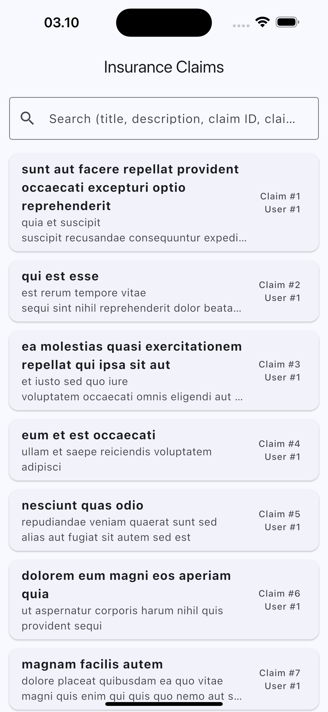
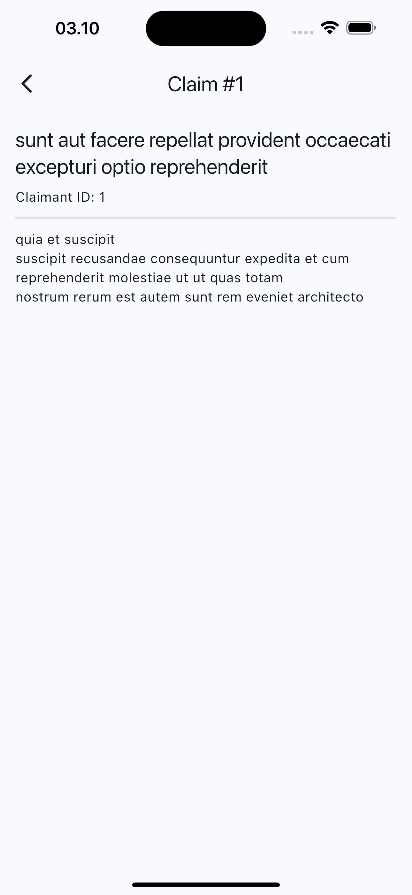

# 📱 Insurance Claims App

A simple mobile application that displays **insurance claims** using mock data from the 
[JSONPlaceholder API](https://jsonplaceholder.typicode.com/posts).

Each post simulates an insurance claim with:
- Claimant ID
- Claim ID
- Claim Title
- Claim Description

---

## 🚀 Features
- Display a scrollable list of claims.
- Each claim shows:
  - **Title** (bold)
  - **Description** (max 2 lines in list view)
  - Claimant ID and Claim ID (optional)
- Tap a claim to view full details.
- Search/filter claims.
- Clean Architecture with separate service and model layers.
- Loading and error states.
- Unit and widget tests.

---

## 🛠 Setup Instructions

### 1. Clone the repository
```bash
git clone https://github.com/yourusername/flutter-insurance-claims.git
cd flutter-insurance-claims
``` 

### 2. Install the Depencies
```bash
flutter pub get
```

### 3. Run the App
```bash
flutter run
```

### 4. Run test for Unit Testing
```bash
flutter test
```

📷 Screenshots


